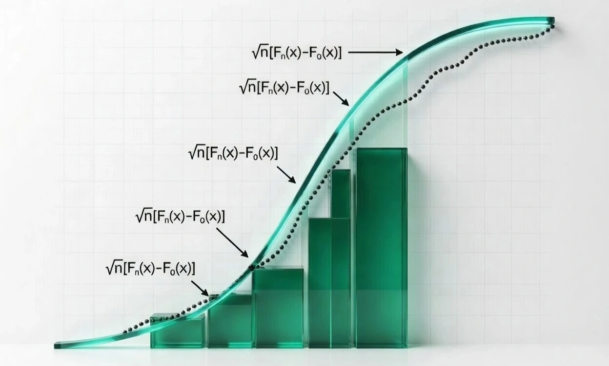

    <h1>Test d'Anderson-Darling</h1>
    <h2>Analyse théorique et implémentation pratique</h2>
    &nbsp;

      

  

## Aperçu   
Ce projet présente un récapitulatif détaillé des étapes de construction du test d'Anderson-Darling, un test de conformité statistique utilisé pour évaluer si un échantillon suit une loi de probabilité donnée.

L'étude est basée sur les articles fondateurs de T.W. Anderson et D.A. Darling, avec une exploration de la construction du test, de ses propriétés asymptotiques et de ses applications.

En complément de l’analyse théorique, le projet inclut également une implémentation pratique du test afin d’illustrer concrètement ses mécanismes et sa sensibilité aux écarts de distribution.

&nbsp;

## Contenu du projet 

### Analyse théorique 

Le document couvre :
- **Historique et évolution** du test depuis sa création en 1954.
- **Construction** mathématique. 
- **Comparaison** avec d'autres tests de conformité statistique. 
- **Avantages et limites** du test d'Anderson-Darling.

➡️ [Analyse théorique du test d'Anderson-Darling (PDF)](./docs/Test-Anderson-Darling-Etude.pdf)

Version anglaise (English version) :  
➡️ [Theoretical analysis of the Anderson-Darling test (PDF)](./docs/Anderson-Darling-Test-Study.pdf)

### Implémentation pratique

Une implémentation pédagogique du test en Python, incluant :
- Construction du statisticien à partir de la forme intégrale
- Implémentation via les statistiques d’ordre
- Analyse de la pondération des queues
- Comparaison avec Kolmogorov–Smirnov

➡️ [Notebook (ipynb)](./src/anderson_darling_practical.ipynb)

&nbsp;

## Références  
- Anderson, T. W., & Darling, D. A. (1952). *Asymptotic theory of certain ‘goodness of fit’ criteria based on stochastic processes*. Annals of Mathematical Statistics, 23, 193-212.  
- Anderson, T. W., & Darling, D. A. (1954). *A Test of Goodness of Fit*. Journal of the American Statistical Association, 49(268), 765-769.  
- Stephens, M. A. (1979). *The Anderson-Darling Statistic*. [Technical Report](https://apps.dtic.mil/sti/pdfs/ADA079807.pdf).  
